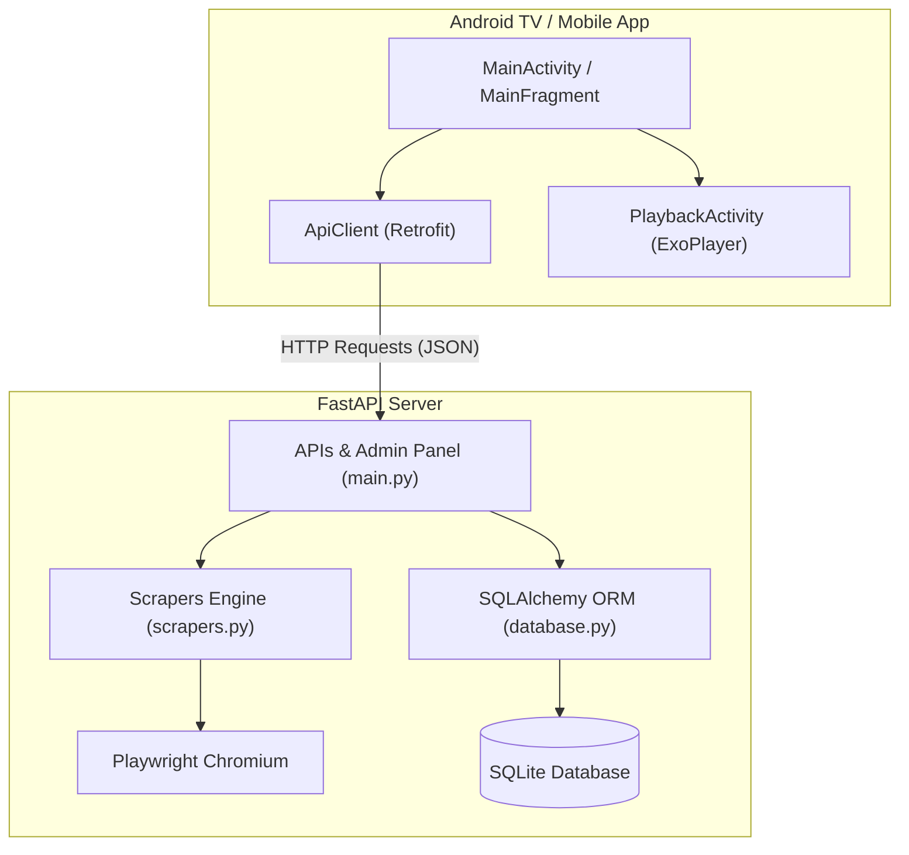

<!-- generated-by: gsd-doc-writer -->
# Architecture Documentation

This document describes the high-level architecture, components, and data flow of the Sports TV App.

## System Overview

Sports TV App uses a client-server architecture consisting of a Python FastAPI backend and native Android TV and Mobile frontends. The backend operates as a scraping engine that dynamically extracts direct HLS stream links (.m3u8) from web streams using Playwright. The client apps fetch these links from the backend's JSON API endpoints and stream them using Google's ExoPlayer library.

```
┌────────────────────────────────────────────────────────────────────────┐
│                              Sports TV App                             │
└────────────────────────────────────────────────────────────────────────┘
                                     │
         HTTP requests / API         ▼
┌────────────────────────────────────────────────────────────────────────┐
│                         FastAPI Backend Server                         │
└────────────────────────────────────────────────────────────────────────┘
             │                                        │
     Reads   ▼                                Scrapes ▼
┌────────────────────────┐               ┌───────────────────────────────┐
│     SQLite Database    │               │  Live Event Sites (Webpages)   │
│    (sports_tv.db)      │               └───────────────────────────────┘
└────────────────────────┘
```

## Component Diagram

The following Mermaid diagram maps the components of the backend and client app:



## Data Flow

The typical lifecycle of a stream request flows as follows:

1. **Admin Submission:** The administrator submits a sport stream URL (e.g. from Sportsurge) via the Admin Panel (`POST /admin/streams`).
2. **Background Extraction:** The backend creates an empty "Extracting..." stream record in the SQLite database and spawns an asynchronous background task (`_run_extraction`).
3. **Web Scraping:** The scraper launches a headless Playwright Chromium instance, navigates to the source page, bypasses standard overlays, and intercepts network traffic to extract the raw HLS (`.m3u8`) streaming URL.
4. **Database Update:** Once the HLS URL is successfully extracted, the scraper updates the database stream record with the stream's title, direct HLS URL, Cloudflare domains, and sets `is_live = true`.
5. **Client Retrieval:** When the Android Client opens, it makes a request to `GET /api/streams`. The backend queries the SQLite database and returns the live stream list.
6. **Playback & Proxying:** The client starts ExoPlayer with the stream's HLS URL. If the HLS server is raw IP-based (which would fail standard Android TV SSL verification), the client routes the request through the backend's `/api/proxy` endpoint, which proxies the TS segments and rewrites playlist URLs dynamically.

## Key Abstractions

### Backend
* **`database.Stream`** ([database.py](file:///D:/projects/sports_tv/backend/database.py)): The SQLAlchemy model representing a single streaming event, storing the original source URL, parsed HLS URL, iframe URL, and live status.
* **`run_scrapers_extract`** ([scrapers.py](file:///D:/projects/sports_tv/backend/scrapers.py)): The asynchronous entry point for Playwright scraping.
* **`lifespan`** ([main.py](file:///D:/projects/sports_tv/backend/main.py)): Coordinates FastAPI application startup (database initialization, Playwright browser pool setup) and shutdown.
* **`hls_proxy`** ([main.py](file:///D:/projects/sports_tv/backend/main.py)): FastAPI endpoint that reverse-proxies HLS `.m3u8` playlists and media segments to bypass SSL and Referer restrictions on client devices.

### Android TV & Mobile App
* **`ApiClient`** ([ApiClient.kt](file:///D:/projects/sports_tv/android_tv_app/app/src/main/java/com/sportstv/app/ApiClient.kt)): Standardized Retrofit HTTP client for communicating with the FastAPI backend.
* **`PlaybackActivity`** ([PlaybackActivity.kt](file:///D:/projects/sports_tv/android_tv_app/app/src/main/java/com/sportstv/app/PlaybackActivity.kt)): Integrates Media3 ExoPlayer, handles buffering state, token refreshes, and includes `DynamicHeaderDataSource` to set required HTTP headers (Referer, Origin) on segment requests.

## Directory Structure Rationale

* **`backend/`**: Contains the complete python backend application.
  * `alembic/`: Database migrations.
  * `templates/`: Jinja2 templates for the Admin Panel HTML dashboard.
  * `main.py` / `database.py` / `scrapers.py`: Primary core files.
* **`android_tv_app/`**: Android Studio project.
  * `app/`: TV App module utilizing Android Leanback library.
  * `mobile/`: Mobile App module using standard phone layouts.
